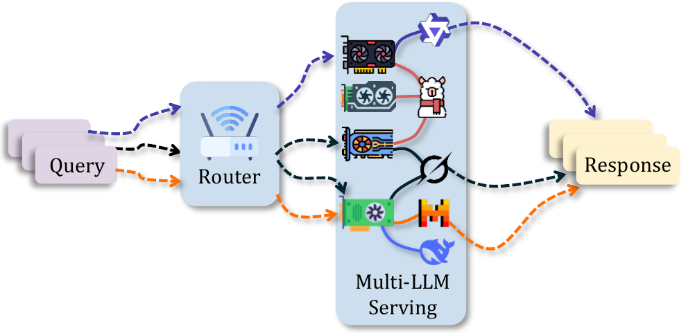
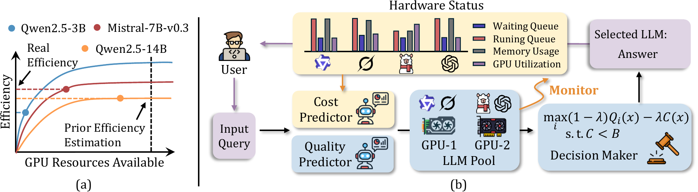

# HW-Router: Hardware-Aware Routing for Scalable Multi-LLM Serving

[](LICENSE)
[](https://www.python.org/downloads/)
[](https://dac.com)

> **Accepted at the 63rd Design Automation Conference (DAC), 2026**

## Overview

<p align="center">
  
</p>

HW-Router is a hardware-aware routing framework for multi-LLM serving that dynamically selects the best model for each incoming request based on both predicted response quality and real-time hardware conditions.

Unlike static routing approaches that ignore server load, HW-Router integrates a lightweight neural cost predictor that estimates per-request latency (TTFT and TPOT) from live hardware metrics (queue depths, KV-cache utilization, GPU load). Combined with an IRT-based quality predictor, this enables quality-cost trade-off decisions that respect Service Level Objectives (SLOs).

Across diverse workloads, HW-Router achieves **3.4–3.9× lower end-to-end latency**, **46–48 percentage points higher SLO attainment**, **6–8× lower GPU load skew**, and a **3.1–3.4× reduction in waiting-queue fraction** over state-of-the-art baselines (CARROT and IRT) — with only **~200 μs** of additional routing overhead and no loss in output quality.

## Architecture



**Components:**

| Component | Module | Description |
|-----------|--------|-------------|
| Hardware Monitor | `hw_router.hardware_monitor` | Polls vLLM Prometheus metrics in real-time |
| Cost Predictor | `hw_router.cost_predictor` | Lightweight MLP predicting TTFT and TPOT — **plug-in component** |
| Quality Predictor | `hw_router.routers` | Any quality predictor: CARROT, IRT, UMR, or custom |
| Decision Maker | `pipeline/evaluation/` | Scores each model: S = (1−λ)·Q − λ·C, picks argmax |

### Modular Design

The hardware cost predictor is a **plug-in** — it works with any quality predictor by replacing the static price/token cost term with real-time hardware-aware latency predictions:

```
Quality-only router:   S = (1−λ) · Q(x)   − λ · static_price/token
Hardware-aware (+HW):  S = (1−λ) · Q(x)   − λ · C(x, h)       ← same Q, HW cost swapped in
                                                      ↑
                                             MLP predicts TTFT + TPOT
                                             from live hardware state h
```

This means **any quality predictor can be made hardware-aware** simply by pairing it with the cost predictor. In the paper we use IRT as the quality component because it yields the best results, but CARROT and UMR benefit equally from hardware cost awareness:

| Quality Predictor | Without HW Cost | With HW Cost (+) | SLO lift |
|-------------------|-----------------|------------------|----------|
| CARROT | 44.7% SLO, 43.9s | 96.1% SLO, 14.4s | +51pp |
| IRT | 42.2% SLO, 45.3s | 97.9% SLO, 12.9s | +56pp ⭐ |
| UMR | 37.3% SLO, 48.4s | 91.5% SLO, 16.7s | +54pp |

*Evaluated at λ = 0.5. IRT+HW is the configuration reported as "HW-Router" in the paper.*

## Quick Start

### Installation

```bash
git clone https://github.com/UCF-ML-Research/HW-Router.git
cd HW-Router
pip install -e .
```

To install with specific components only:

```bash
pip install -e ".[irt]"       # Core + IRT quality predictor
pip install -e ".[carrot]"    # Core + CARROT baseline
pip install -e ".[serving]"   # Core + vLLM serving stack
pip install -e ".[all]"       # Everything
```

### Using the Routers

All routers share the same interface — `compute(model_name, prompt) -> (quality, cost)`:

```python
from hw_router import BaselineRouter, IRTRouter, CarrotRouter, UMRRouter
from hw_router.constants import DEFAULT_LAMBDA

# Choose a quality predictor
router = BaselineRouter()  # Static quality lookup (no dependencies)
# router = IRTRouter()     # IRT-based quality (requires transformers)
# router = UMRRouter()     # Cluster-based quality (requires sentence-transformers)

# Score each candidate model
prompt = "Explain quantum computing in simple terms."
models = ["Qwen2.5-14B-Instruct", "Llama-3.1-8B-Instruct", "Qwen2.5-3B-Instruct"]

for model in models:
    quality, cost = router.compute(model, prompt)
    score = DEFAULT_LAMBDA * quality - (1 - DEFAULT_LAMBDA) * cost
    print(f"{model}: quality={quality:.3f}, score={score:.4f}")
```

### Running on Your Own Hardware

Want to run HW-Router with your own GPUs and models? See **[docs/CUSTOM_HARDWARE_GUIDE.md](docs/CUSTOM_HARDWARE_GUIDE.md)** for a step-by-step walkthrough covering LLM pool config, vLLM setup, data collection, training, and evaluation.

### Reproducing the Paper Results

> **Prerequisites:** Steps 2 and 5 require live vLLM servers and at least 2× NVIDIA H100 GPUs (or equivalent). Steps 1, 3, 4, and the offline sweep in Step 5 run on CPU only. See [docs/CUSTOM_HARDWARE_GUIDE.md](docs/CUSTOM_HARDWARE_GUIDE.md) if you are adapting this to your own hardware.

The pipeline lives under `pipeline/` and is organized in execution order.

#### Step 1 — Data preparation (CPU only)

Download prompts from MixInstruct and LongBench and build the combined train/eval splits.

```bash
python pipeline/data_preparation/load_mixinstruct.py
python pipeline/data_preparation/load_longbench.py
python pipeline/data_preparation/combine_datasets.py

# Prompt embeddings (used by CARROT and eval processing)
python pipeline/data_preparation/save_prompt_embeddings.py \
    --input  data/prompts/mixed_prompts_train.parquet \
    --output data/prompts/mixed_prompts_train_with_prompt_embeddings.parquet
python pipeline/data_preparation/save_prompt_embeddings.py \
    --input  data/prompts/mixed_prompts_eval.parquet \
    --output data/prompts/mixed_prompts_eval_with_prompt_embeddings.parquet

# Optional: rebuild the UMR training CSV from judge scores
python pipeline/data_preparation/build_umr_training_csv.py
```

**Output:** `data/prompts/mixed_prompts_{train,eval}.parquet` (+ embeddings)

#### Step 2 — Hardware data collection (requires live vLLM + H100s)

Launch the vLLM servers defined in `configs/gpu_model_map_h100.yaml`, then collect training and evaluation latency data.

```bash
python pipeline/data_collection/build_hardware_cost_dataset.py \
    --config configs/gpu_model_map_h100.yaml \
    --output data/h100_full_sweep.csv \
    --pattern poisson --rate 5.0

python pipeline/data_collection/build_eval_dataset.py \
    --config configs/gpu_model_map_h100.yaml \
    --output data/evaluation_dataset.csv

python pipeline/data_collection/compute_normalization.py
```

**Output:** `data/h100_full_sweep.csv`, `data/evaluation_dataset.csv`

#### Step 3 — Train the cost model (CPU only, ~20s)

```bash
python -m pipeline.training.train_cost_model
```

**Output:** `checkpoints/hardware_cost_model/{model.pt, preproc.joblib}`

#### Step 4 — Process the evaluation dataset (CPU only)

Append CARROT, UMR, and IRT predictions to the eval CSV. Run in order.

```bash
python pipeline/eval_processing/process_eval_dataset.py \
    --input  data/evaluation_dataset.csv \
    --output data/evaluation_dataset_processed_full.csv
python pipeline/eval_processing/update_eval_with_umr.py
python pipeline/eval_processing/update_eval_with_irt.py
```

**Output:** `data/evaluation_dataset_processed_full_with_umr_irt.csv`

#### Step 5 — Evaluation

Offline λ-sweep runs on CPU. Online evaluation requires live vLLM servers.

```bash
# Offline λ-sweep (Figure 4a, 4b)
python pipeline/evaluation/eval_lambda_sweep.py \
    --input data/evaluation_dataset_processed_full_with_umr_irt.csv

# Online runtime router
python pipeline/evaluation/eval_runtime_router.py \
    --config      configs/gpu_model_map_h100.yaml \
    --prompt_path data/prompts/mixed_prompts_eval.parquet \
    --eval_csv    data/evaluation_dataset_processed_full_with_umr_irt.csv \
    --router      hw

# Online arrival-rate sweep
python pipeline/evaluation/eval_realtime_sweep.py \
    --router hw \
    --arrival_rates "15,18,21" \
    --pattern_type sustained
```

#### Retraining the baselines (optional)

Pre-trained IRT and UMR artifacts are shipped under `baselines/`. To retrain from scratch after changing the model pool, use the judge scores under `data/data_quality/`:

```bash
python pipeline/data_preparation/build_umr_training_csv.py

python baselines/irt/train_irt.py train \
    --data-path data/UMR_router_training_data.csv \
    --checkpoint baselines/irt/mirt_hw.snapshot

python baselines/umr/umr_router.py train \
    --train_csv data/UMR_router_training_data.csv \
    --work_dir  checkpoints/umr
```

## Models

Evaluated with 5 LLMs across 2 NVIDIA H100 GPUs:

- **GPU 0:** Qwen2.5-14B-Instruct, Phi-3-mini-128k-instruct (3.8B)
- **GPU 1:** Llama-3.1-8B-Instruct, Qwen2.5-3B-Instruct, Mistral-7B-Instruct-v0.3

## Adding Your Own Router

Subclass `BaseRouter` and implement the `compute()` method:

```python
from hw_router import BaseRouter

class MyRouter(BaseRouter):
    def compute(self, model_name: str, prompt: str):
        quality = your_quality_function(model_name, prompt)
        cost = your_cost_function(model_name, prompt)
        return quality, cost
```

See [CONTRIBUTING.md](CONTRIBUTING.md) for full details.

## Citation

```bibtex
@inproceedings{kabir2026hwrouter,
  title     = {{HW-Router}: Hardware-Aware Routing for Scalable Multi-{LLM} Serving},
  author    = {Kabir, Ahasan and Xue, Jiaqi and Zheng, Mengxin and Lou, Qian},
  booktitle = {Proceedings of the 63rd Design Automation Conference (DAC)},
  year      = {2026}
}
```

## License

This project is licensed under the Apache License 2.0 — see [LICENSE](LICENSE) for details.
